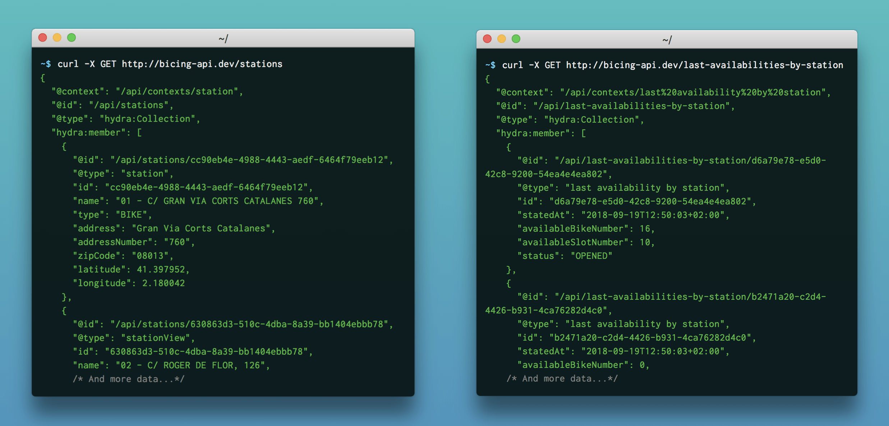
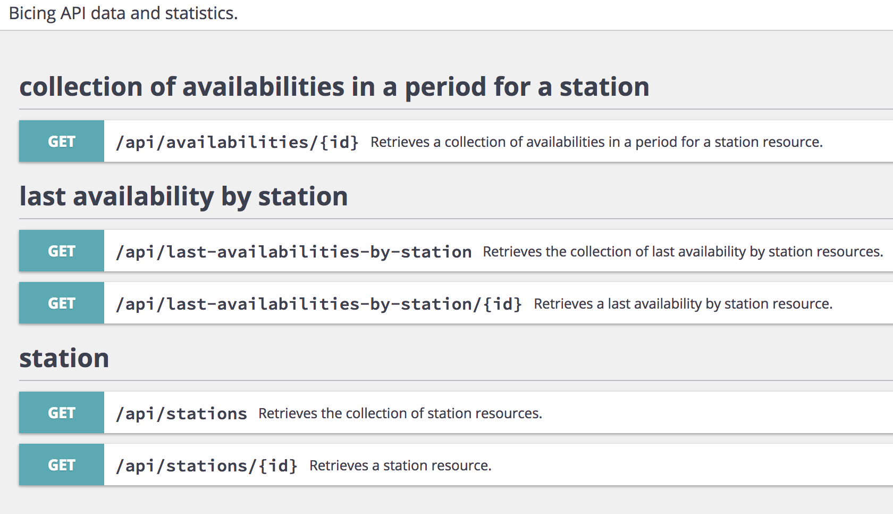
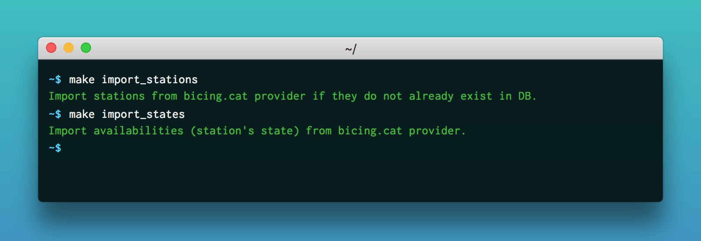
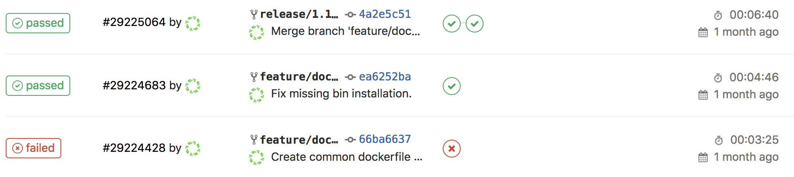

<p align="center">
    
</p>
<h1 align="center">Bicing API</h1>

<h4 align="center">Get statistics and locations of bicycle stations.</h4>

> The goal of this REST API is to ease customer's usage of large-scale public bicycle sharing system.  
> By collecting data from different providers ([Bicing][bicing], [Velib][velib], ...) it can advice customers or provide them useful information (location to pick or return a bike, best time of picking up a bike, ...).

<p align="center">
    
    
    
    <a href="https://opensource.org/licenses/MIT"><a>
</p>

<p align="center">
  <a href="#getting-started">Getting Started</a> •
  <a href="#features">Features</a> •
  <a href="#build-with">Built With</a> •
  <a href="#development">Development</a> •
  <a href="#coding-standard">Coding Standard</a> •
  <a href="#ci-and-deployment">CI and Deployment</a>
</p>



## <a name="getting-started"></a> Getting Started
### Prerequisites

To install and run the API you need [Docker Compose](docker-compose) and... that's all.
Please follow the [official documentation](docker-compose-install) to install it on your environment.

### Installing
Clone the project and run the default installation:

```bash
git clone https://github.com/lechatquidanse/bicing-api.git && cd bicing-api
make install
```
Your docker containers should have been successfully built and run.

## Features

To follow the goals of the API, this project offers many features across 2 user interfaces:

### REST API:


### CLI:



To run the project once installed:

## <a name="built-with"></a> Built with

- [PHP 7.1][php]
- [Symfony 4.0][symfony]
- [API-Platform][api-platform]
- [Timescale Database][timescale]
- [Docker][docker]

## Development
The Makefile contains useful command for development purpose


## <a name="coding-standard"></a> Coding standard

### Domain Driven Design

Code and folder structure follow Domain Driven Design (DDD).  
Here is a good article to understand naming and folder [Domain Driver Design, little explanation and example](https://jorgearco.com/ddd-with-symfony/).

    src
        \
            |\ Application     `Contains the Use Cases and the Processes of the domain system, commands, handlers and subscribers`
            |
            |\ Domain          `The system business logic layer (Models, Events, Exceptions...)`
            |
            |\ Infrastructure  `Its the implementation of the system outside the model. I.E: Persistence, Query, etc`
            |
            |\ UserInterface   `It contains all the interfaces allowed for a user of the API (Cli, HTTP, Rest, etc)`

### Command Query Responsibility Segregation

To avoid complexity in code, in this project, a use case is a command or a query with a single responsibility.
This use case is then handled by a handler for a command or a data provider for a query.

Commands are handled by a message bus ([SimpleBus][simplebus]) where a command is link to one handler.   
For example, to create a station in database:


## <a name="ci-and-deployment"></a> CI and Deployment

CI and deployment can handled threw [Gitlab][gitlab] and [Docker][docker] thanks to [.gitlab-ci.yml](./.gitlab-ci.yml)
It contains 3 different stages.

### Test

Environment 'test' is triggered when a 'feature/*' branch is pushed to the repository. 
It will then install project and launch qa tools. 

### Build

Environment 'build' is triggered when a 'release/*' branch is pushed to the repository. 
It will then install project, launch qa tools and then build and push a docker image on a registry if no error occured.

### Production

This manual action, will pull the image build by the previous step and update the specific container.



## License

[MIT](https://opensource.org/licenses/MIT)

> Stéphane EL MANOUNI &nbsp;&middot;&nbsp;
> [Linkedin](https://www.linkedin.com/in/stephane-el-manouni/)

[api-platform]: https://api-platform.com/
[bicing]: https://www.bicing.cat/
[docker]: https://www.docker.com/
[docker-compose]: https://docs.docker.com/compose/
[docker-compose-install]: https://docs.docker.com/compose/install
[gitlab]: https://gitlab.com/
[php]: http://php.net/
[simplebus]: https://github.com/SimpleBus/SimpleBus
[symfony]: http://symfony.com/
[timescale]: http://www.timescale.com/
[velib]: https://www.velib-metropole.fr/
[wiki-DDD]: https://en.wikipedia.org/wiki/Domain-driven_design
