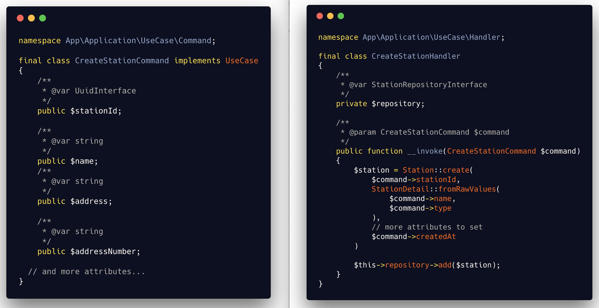

<p align="center">
    
</p>
<h1 align="center">Bicing API</h1>

<h4 align="center">Get statistics and locations of bicycle stations.</h4>

> The goal of this REST API is to ease customer's usage of large-scale public bicycle sharing system.  
> By collecting data from different providers ([Bicing][bicing], [Velib][velib], ...) it can advice customers or provide them useful information (location to pick or return a bike, best time of picking up a bike, ...).

&nbsp;&nbsp;&nbsp;&nbsp;&nbsp;&nbsp;&nbsp;&nbsp;&nbsp;&nbsp;&nbsp;&nbsp;&nbsp;&nbsp;&nbsp;&nbsp;&nbsp;&nbsp;&nbsp;


[](https://opensource.org/licenses/MIT)

<p align="center">
  <a href="#getting-started">Getting Started</a> •
  <a href="#features">Features</a> •
  <a href="#build-with">Built With</a> •
  <a href="#development">Development</a> •
  <a href="#coding-standard">Coding Standard</a> •
  <a href="#ci-and-deployment">CI and Deployment</a>
</p>

| <img src="data:image/svg+xml;base64,PHN2ZyB4bWxucz0iaHR0cDovL3d3dy53My5vcmcvMjAwMC9zdmciIHZpZXdCb3g9IjAgMCA2MjAgNjAwIiB3aWR0aD0iNjIwIiBoZWlnaHQ9IjYwMCI+PGZvcmVpZ25PYmplY3Qgd2lkdGg9IjEwMCUiIGhlaWdodD0iMTAwJSI+PHN0eWxlPkBpbXBvcnQgdXJsKCJodHRwczovL2ZvbnRzLmdvb2dsZWFwaXMuY29tL2Nzcz9mYW1pbHk9SW5jb25zb2xhdGEiKTsuXzJsMyB7IG1heC13aWR0aDogMTAwJTsgYm94LXNpemluZzogYm9yZGVyLWJveDsgZGlzcGxheTogZmxleDsgYWxpZ24taXRlbXM6IGNlbnRlcjsganVzdGlmeS1jb250ZW50OiBjZW50ZXI7IH0uXzJuaCB7IHBhZGRpbmc6IDQ1cHg7IH0uXzFlUiB7IGRpc3BsYXk6IGZsZXg7IGZsZXgtZGlyZWN0aW9uOiBjb2x1bW47IHdpZHRoOiAxMDAlOyBoZWlnaHQ6IDEwMCU7IG92ZXJmbG93OiBoaWRkZW47IGJvcmRlci1yYWRpdXM6IDVweDsgdXNlci1zZWxlY3Q6IG5vbmU7IGJhY2tncm91bmQ6IHJnYigxNSwgMjAsIDIwKTsgcG9zaXRpb246IHJlbGF0aXZlOyB9Ll8ybmggLl8xZVIgeyBiYWNrZ3JvdW5kOiByZ2JhKDUsIDIwLCAyMCwgMC45NCk7IGJveC1zaGFkb3c6IHJnYmEoMCwgMCwgMCwgMC40NykgMHB4IDI2cHggNDNweCAwcHgsIHJnYmEoMCwgMCwgMCwgMC4zNCkgMHB4IDBweCAycHggMHB4OyB9Ll9INSB7IGJvcmRlci1yYWRpdXM6IDVweCA1cHggMHB4IDBweDsgdGV4dC1vdmVyZmxvdzogZWxsaXBzaXM7IHBhZGRpbmc6IDBweCA4MHB4OyB3aGl0ZS1zcGFjZTogbm93cmFwOyBvdmVyZmxvdzogaGlkZGVuOyBsaW5lLWhlaWdodDogMjRweDsgdGV4dC1hbGlnbjogY2VudGVyOyBjb2xvcjogcmdiKDQ2LCA0NiwgNDYpOyBmb250LWZhbWlseTogLWFwcGxlLXN5c3RlbSwgQmxpbmtNYWNTeXN0ZW1Gb250LCAiU2Vnb2UgVUkiLCBSb2JvdG8sIEhlbHZldGljYSwgQXJpYWwsIHNhbnMtc2VyaWY7IGZvbnQtc2l6ZTogMTRweDsgYmFja2dyb3VuZDogbGluZWFyLWdyYWRpZW50KDBkZWcsIHJnYigyMDIsIDIwMiwgMjAyKSwgcmdiKDIyNiwgMjI2LCAyMjYpKTsgYm9yZGVyLXRvcDogMC41cHggc29saWQgcmdiKDI0MywgMjQzLCAyNDMpOyBib3JkZXItYm90dG9tOiAwLjVweCBzb2xpZCByZ2IoMTI1LCAxMjUsIDEyNSk7IH0uXzJTRiwgLl9INSB7IGhlaWdodDogMjVweDsgfS5fMlNGOjpiZWZvcmUgeyBjb250ZW50OiAiIjsgcG9zaXRpb246IGFic29sdXRlOyB0b3A6IDdweDsgbGVmdDogMTBweDsgd2lkdGg6IDEwcHg7IGhlaWdodDogMTBweDsgYmFja2dyb3VuZDogcmdiKDI0OSwgOTIsIDkxKTsgYm9yZGVyLXJhZGl1czogMTAwJTsgYm94LXNoYWRvdzogcmdiKDIxOCwgNjEsIDY2KSAwcHggMHB4IDBweCAxcHgsIHJnYigyNTAsIDE5MCwgNTkpIDIwcHggMHB4IDBweCAwcHgsIHJnYigyMzYsIDE3NiwgNjIpIDIwcHggMHB4IDBweCAxcHgsIHJnYig1NiwgMjA1LCA3MCkgNDBweCAwcHggMHB4IDBweCwgcmdiKDQ2LCAxNzQsIDUwKSA0MHB4IDBweCAwcHggMXB4OyB9Ll8xamcgeyBkaXNwbGF5OiBmbGV4OyBmbGV4LWRpcmVjdGlvbjogY29sdW1uLXJldmVyc2U7IGZsZXg6IDEgMSAwJTsgb3ZlcmZsb3c6IGF1dG87IGZvbnQtZmFtaWx5OiBJbmNvbnNvbGF0YSwgQ29uc29sYXMsICJMdWNpZGEgQ29uc29sZSIsICJMdWNpZGEgU2FucyBUeXBld3JpdGVyIiwgTW9uYWNvLCBtb25vc3BhY2U7IGZvbnQtc2l6ZTogMTRweDsgbGluZS1oZWlnaHQ6IDEuMzY7IGxldHRlci1zcGFjaW5nOiAwLjAzZW07IGNvbG9yOiByZ2IoMjM1LCAyMzUsIDIzNSk7IHdoaXRlLXNwYWNlOiBwcmUtd3JhcDsgfS5fMTNWIHsgZmxleDogMSAxIDAlOyBwYWRkaW5nOiAxMnB4OyB9Ll8ybU8geyBwYWRkaW5nOiAwcHggOXB4IDBweCAwcHg7IH0uXzJtTywgLmdSOSB7IGRpc3BsYXk6IGlubGluZS1mbGV4OyBmbGV4LXdyYXA6IHdyYXA7IHZlcnRpY2FsLWFsaWduOiBtaWRkbGU7IH0uXzNlaiwgLmdSOSB7IHVzZXItc2VsZWN0OiB0ZXh0OyB9Ll8ybU8sIC5fM2VqLCAuZ1I5LCAuZ1I5IHNwYW4geyB3aWR0aDogMHB4OyBoZWlnaHQ6IDBweDsgb3ZlcmZsb3c6IGhpZGRlbjsgYW5pbWF0aW9uOiBfMWFxIDAuMDAxbXMgbGluZWFyIDBzIDEgbm9ybWFsIGZvcndhcmRzIHJ1bm5pbmc7IH0uXzFKaSB7IGFuaW1hdGlvbjogXzFhcSAwLjAwMW1zIGxpbmVhciAwcyAxIG5vcm1hbCBmb3J3YXJkcyBydW5uaW5nLCB5WkQgMG1zIGxpbmVhciAwcyAxIG5vcm1hbCBmb3J3YXJkcyBydW5uaW5nOyB9Ll8zMEsgeyBkaXNwbGF5OiBpbmxpbmUtYmxvY2s7IHZlcnRpY2FsLWFsaWduOiBtaWRkbGU7IGJhY2tncm91bmQ6IHJnYigxMDIsIDEwMiwgMTAyKTsgYW5pbWF0aW9uOiBoT1AgMC4wMDFtcyBsaW5lYXIgMHMgMSBub3JtYWwgZm9yd2FyZHMgcnVubmluZywgeVpEIDBtcyBsaW5lYXIgMHMgMSBub3JtYWwgZm9yd2FyZHMgcnVubmluZzsgfUBrZXlmcmFtZXMgXzFhcSB7ICAgMTAwJSB7IHdpZHRoOiBhdXRvOyBoZWlnaHQ6IGF1dG87IH19QGtleWZyYW1lcyB5WkQgeyAgIDEwMCUgeyB3aWR0aDogMHB4OyBoZWlnaHQ6IDBweDsgfX1Aa2V5ZnJhbWVzIGhPUCB7ICAgMTAwJSB7IHdpZHRoOiA3cHg7IGhlaWdodDogMTdweDsgfX08L3N0eWxlPjxkaXYgeG1sbnM9Imh0dHA6Ly93d3cudzMub3JnLzE5OTkveGh0bWwiIGNsYXNzPSJfMUFvIj48ZGl2IGNsYXNzPSJfMmwzIF8ybmgiIHN0eWxlPSJ3aWR0aDogNjIwcHg7IGhlaWdodDogNjAwcHg7IGJhY2tncm91bmQtaW1hZ2U6IGxpbmVhci1ncmFkaWVudChyZ2IoNjQsIDE5MSwgMTkxKSwgcmdiKDY0LCAxNDksIDE5MSkpOyI+PGRpdiBjbGFzcz0iXzFlUiI+PGRpdiBjbGFzcz0iX0g1IF8yU0YiPn4vPC9kaXY+PGRpdiBjbGFzcz0iXzFqZyI+PGRpdiBjbGFzcz0iXzEzViI+PGRpdiBjbGFzcz0iXzJtTyIgc3R5bGU9ImNvbG9yOiByZ2IoOTQsIDIxNSwgMjU1KTsgYW5pbWF0aW9uLWRlbGF5OiAwbXM7Ij5+JDwvZGl2PjxkaXYgY2xhc3M9ImdSOSIgc3R5bGU9ImFuaW1hdGlvbi1kZWxheTogMG1zOyI+PHNwYW4gc3R5bGU9ImFuaW1hdGlvbi1kZWxheTogNzUwbXM7Ij5jPC9zcGFuPjxzcGFuIHN0eWxlPSJhbmltYXRpb24tZGVsYXk6IDc4NW1zOyI+dTwvc3Bhbj48c3BhbiBzdHlsZT0iYW5pbWF0aW9uLWRlbGF5OiA4MjBtczsiPnI8L3NwYW4+PHNwYW4gc3R5bGU9ImFuaW1hdGlvbi1kZWxheTogODU1bXM7Ij5sPC9zcGFuPjxzcGFuIHN0eWxlPSJhbmltYXRpb24tZGVsYXk6IDg5MG1zOyI+IDwvc3Bhbj48c3BhbiBzdHlsZT0iYW5pbWF0aW9uLWRlbGF5OiA5MjVtczsiPi08L3NwYW4+PHNwYW4gc3R5bGU9ImFuaW1hdGlvbi1kZWxheTogOTYwbXM7Ij5YPC9zcGFuPjxzcGFuIHN0eWxlPSJhbmltYXRpb24tZGVsYXk6IDk5NW1zOyI+IDwvc3Bhbj48c3BhbiBzdHlsZT0iYW5pbWF0aW9uLWRlbGF5OiAxMDMwbXM7Ij5HPC9zcGFuPjxzcGFuIHN0eWxlPSJhbmltYXRpb24tZGVsYXk6IDEwNjVtczsiPkU8L3NwYW4+PHNwYW4gc3R5bGU9ImFuaW1hdGlvbi1kZWxheTogMTEwMG1zOyI+VDwvc3Bhbj48c3BhbiBzdHlsZT0iYW5pbWF0aW9uLWRlbGF5OiAxMTM1bXM7Ij4gPC9zcGFuPjxzcGFuIHN0eWxlPSJhbmltYXRpb24tZGVsYXk6IDExNzBtczsiPmg8L3NwYW4+PHNwYW4gc3R5bGU9ImFuaW1hdGlvbi1kZWxheTogMTIwNW1zOyI+dDwvc3Bhbj48c3BhbiBzdHlsZT0iYW5pbWF0aW9uLWRlbGF5OiAxMjQwbXM7Ij50PC9zcGFuPjxzcGFuIHN0eWxlPSJhbmltYXRpb24tZGVsYXk6IDEyNzVtczsiPnA8L3NwYW4+PHNwYW4gc3R5bGU9ImFuaW1hdGlvbi1kZWxheTogMTMxMG1zOyI+Ojwvc3Bhbj48c3BhbiBzdHlsZT0iYW5pbWF0aW9uLWRlbGF5OiAxMzQ1bXM7Ij4vPC9zcGFuPjxzcGFuIHN0eWxlPSJhbmltYXRpb24tZGVsYXk6IDEzODBtczsiPi88L3NwYW4+PHNwYW4gc3R5bGU9ImFuaW1hdGlvbi1kZWxheTogMTQxNW1zOyI+Yjwvc3Bhbj48c3BhbiBzdHlsZT0iYW5pbWF0aW9uLWRlbGF5OiAxNDUwbXM7Ij5pPC9zcGFuPjxzcGFuIHN0eWxlPSJhbmltYXRpb24tZGVsYXk6IDE0ODVtczsiPmM8L3NwYW4+PHNwYW4gc3R5bGU9ImFuaW1hdGlvbi1kZWxheTogMTUyMG1zOyI+aTwvc3Bhbj48c3BhbiBzdHlsZT0iYW5pbWF0aW9uLWRlbGF5OiAxNTU1bXM7Ij5uPC9zcGFuPjxzcGFuIHN0eWxlPSJhbmltYXRpb24tZGVsYXk6IDE1OTBtczsiPmc8L3NwYW4+PHNwYW4gc3R5bGU9ImFuaW1hdGlvbi1kZWxheTogMTYyNW1zOyI+LTwvc3Bhbj48c3BhbiBzdHlsZT0iYW5pbWF0aW9uLWRlbGF5OiAxNjYwbXM7Ij5hPC9zcGFuPjxzcGFuIHN0eWxlPSJhbmltYXRpb24tZGVsYXk6IDE2OTVtczsiPnA8L3NwYW4+PHNwYW4gc3R5bGU9ImFuaW1hdGlvbi1kZWxheTogMTczMG1zOyI+aTwvc3Bhbj48c3BhbiBzdHlsZT0iYW5pbWF0aW9uLWRlbGF5OiAxNzY1bXM7Ij4uPC9zcGFuPjxzcGFuIHN0eWxlPSJhbmltYXRpb24tZGVsYXk6IDE4MDBtczsiPmQ8L3NwYW4+PHNwYW4gc3R5bGU9ImFuaW1hdGlvbi1kZWxheTogMTgzNW1zOyI+ZTwvc3Bhbj48c3BhbiBzdHlsZT0iYW5pbWF0aW9uLWRlbGF5OiAxODcwbXM7Ij52PC9zcGFuPjxzcGFuIHN0eWxlPSJhbmltYXRpb24tZGVsYXk6IDE5MDVtczsiPi88L3NwYW4+PHNwYW4gc3R5bGU9ImFuaW1hdGlvbi1kZWxheTogMTk0MG1zOyI+bDwvc3Bhbj48c3BhbiBzdHlsZT0iYW5pbWF0aW9uLWRlbGF5OiAxOTc1bXM7Ij5hPC9zcGFuPjxzcGFuIHN0eWxlPSJhbmltYXRpb24tZGVsYXk6IDIwMTBtczsiPnM8L3NwYW4+PHNwYW4gc3R5bGU9ImFuaW1hdGlvbi1kZWxheTogMjA0NW1zOyI+dDwvc3Bhbj48c3BhbiBzdHlsZT0iYW5pbWF0aW9uLWRlbGF5OiAyMDgwbXM7Ij4tPC9zcGFuPjxzcGFuIHN0eWxlPSJhbmltYXRpb24tZGVsYXk6IDIxMTVtczsiPmE8L3NwYW4+PHNwYW4gc3R5bGU9ImFuaW1hdGlvbi1kZWxheTogMjE1MG1zOyI+djwvc3Bhbj48c3BhbiBzdHlsZT0iYW5pbWF0aW9uLWRlbGF5OiAyMTg1bXM7Ij5hPC9zcGFuPjxzcGFuIHN0eWxlPSJhbmltYXRpb24tZGVsYXk6IDIyMjBtczsiPmk8L3NwYW4+PHNwYW4gc3R5bGU9ImFuaW1hdGlvbi1kZWxheTogMjI1NW1zOyI+bDwvc3Bhbj48c3BhbiBzdHlsZT0iYW5pbWF0aW9uLWRlbGF5OiAyMjkwbXM7Ij5hPC9zcGFuPjxzcGFuIHN0eWxlPSJhbmltYXRpb24tZGVsYXk6IDIzMjVtczsiPmI8L3NwYW4+PHNwYW4gc3R5bGU9ImFuaW1hdGlvbi1kZWxheTogMjM2MG1zOyI+aTwvc3Bhbj48c3BhbiBzdHlsZT0iYW5pbWF0aW9uLWRlbGF5OiAyMzk1bXM7Ij5sPC9zcGFuPjxzcGFuIHN0eWxlPSJhbmltYXRpb24tZGVsYXk6IDI0MzBtczsiPmk8L3NwYW4+PHNwYW4gc3R5bGU9ImFuaW1hdGlvbi1kZWxheTogMjQ2NW1zOyI+dDwvc3Bhbj48c3BhbiBzdHlsZT0iYW5pbWF0aW9uLWRlbGF5OiAyNTAwbXM7Ij5pPC9zcGFuPjxzcGFuIHN0eWxlPSJhbmltYXRpb24tZGVsYXk6IDI1MzVtczsiPmU8L3NwYW4+PHNwYW4gc3R5bGU9ImFuaW1hdGlvbi1kZWxheTogMjU3MG1zOyI+czwvc3Bhbj48c3BhbiBzdHlsZT0iYW5pbWF0aW9uLWRlbGF5OiAyNjA1bXM7Ij4tPC9zcGFuPjxzcGFuIHN0eWxlPSJhbmltYXRpb24tZGVsYXk6IDI2NDBtczsiPmI8L3NwYW4+PHNwYW4gc3R5bGU9ImFuaW1hdGlvbi1kZWxheTogMjY3NW1zOyI+eTwvc3Bhbj48c3BhbiBzdHlsZT0iYW5pbWF0aW9uLWRlbGF5OiAyNzEwbXM7Ij4tPC9zcGFuPjxzcGFuIHN0eWxlPSJhbmltYXRpb24tZGVsYXk6IDI3NDVtczsiPnM8L3NwYW4+PHNwYW4gc3R5bGU9ImFuaW1hdGlvbi1kZWxheTogMjc4MG1zOyI+dDwvc3Bhbj48c3BhbiBzdHlsZT0iYW5pbWF0aW9uLWRlbGF5OiAyODE1bXM7Ij5hPC9zcGFuPjxzcGFuIHN0eWxlPSJhbmltYXRpb24tZGVsYXk6IDI4NTBtczsiPnQ8L3NwYW4+PHNwYW4gc3R5bGU9ImFuaW1hdGlvbi1kZWxheTogMjg4NW1zOyI+aTwvc3Bhbj48c3BhbiBzdHlsZT0iYW5pbWF0aW9uLWRlbGF5OiAyOTIwbXM7Ij5vPC9zcGFuPjxzcGFuIHN0eWxlPSJhbmltYXRpb24tZGVsYXk6IDI5NTVtczsiPm48L3NwYW4+PC9kaXY+PGRpdiBjbGFzcz0iXzMwSyIgc3R5bGU9ImFuaW1hdGlvbi1kZWxheTogMG1zLCAzMzQwbXM7Ij48L2Rpdj48ZGl2IGNsYXNzPSJfM2VqIiBzdHlsZT0iYW5pbWF0aW9uLWRlbGF5OiAzODQwbXM7Ij48c3BhbiBzdHlsZT0iY29sb3I6IzRCQjU0MyI+ezxiciAvPiAgIkBjb250ZXh0IjogIi9hcGkvY29udGV4dHMvbGFzdCUyMGF2YWlsYWJpbGl0eSUyMGJ5JTIwc3RhdGlvbiIsPGJyIC8+ICAiQGlkIjogIi9hcGkvbGFzdC1hdmFpbGFiaWxpdGllcy1ieS1zdGF0aW9uIiw8YnIgLz4gICJAdHlwZSI6ICJoeWRyYTpDb2xsZWN0aW9uIiw8YnIgLz4gICJoeWRyYTptZW1iZXIiOiBbPGJyIC8+ICAgIHs8YnIgLz4gICAgICAiQGlkIjogIi9hcGkvbGFzdC1hdmFpbGFiaWxpdGllcy1ieS1zdGF0aW9uL2Q2YTc5ZTc4LWU1ZDAtNDJjOC05MjAwLTU0ZWE0ZTRlYTgwMiIsPGJyIC8+ICAgICAgIkB0eXBlIjogImxhc3QgYXZhaWxhYmlsaXR5IGJ5IHN0YXRpb24iLDxiciAvPiAgICAgICJpZCI6ICJkNmE3OWU3OC1lNWQwLTQyYzgtOTIwMC01NGVhNGU0ZWE4MDIiLDxiciAvPiAgICAgICJzdGF0ZWRBdCI6ICIyMDE4LTA5LTE5VDEyOjUwOjAzKzAyOjAwIiw8YnIgLz4gICAgICAiYXZhaWxhYmxlQmlrZU51bWJlciI6IDE2LDxiciAvPiAgICAgICJhdmFpbGFibGVTbG90TnVtYmVyIjogMTAsPGJyIC8+ICAgICAgInN0YXR1cyI6ICJPUEVORUQiPGJyIC8+ICAgIH0sPGJyIC8+ICAgIHs8YnIgLz4gICAgICAiQGlkIjogIi9hcGkvbGFzdC1hdmFpbGFiaWxpdGllcy1ieS1zdGF0aW9uL2IyNDcxYTIwLWMyZDQtNDQyNi1iOTMxLTRjYTc2MjgyZDRjMCIsPGJyIC8+ICAgICAgIkB0eXBlIjogImxhc3QgYXZhaWxhYmlsaXR5IGJ5IHN0YXRpb24iLDxiciAvPiAgICAgICJpZCI6ICJiMjQ3MWEyMC1jMmQ0LTQ0MjYtYjkzMS00Y2E3NjI4MmQ0YzAiLDxiciAvPiAgICAgICJzdGF0ZWRBdCI6ICIyMDE4LTA5LTE5VDEyOjUwOjAzKzAyOjAwIiw8YnIgLz4gICAgICAiYXZhaWxhYmxlQmlrZU51bWJlciI6IDAsPC9zcGFuPjxiciAvPiAgICA8c3BhbiBzdHlsZT0iY29sb3I6IzgwODA4MCI+LyogQW5kIG1vcmUgZGF0YS4uLiovPC9zcGFuPjwvZGl2PjwvZGl2PjwvZGl2PjwvZGl2PjwvZGl2PjwvZGl2PjwvZm9yZWlnbk9iamVjdD48L3N2Zz4=" alt="List stations"> | <img src="data:image/svg+xml;base64,PHN2ZyB4bWxucz0iaHR0cDovL3d3dy53My5vcmcvMjAwMC9zdmciIHZpZXdCb3g9IjAgMCA2MjAgNjAwIiB3aWR0aD0iNjIwIiBoZWlnaHQ9IjYwMCI+PGZvcmVpZ25PYmplY3Qgd2lkdGg9IjEwMCUiIGhlaWdodD0iMTAwJSI+PHN0eWxlPkBpbXBvcnQgdXJsKCJodHRwczovL2ZvbnRzLmdvb2dsZWFwaXMuY29tL2Nzcz9mYW1pbHk9SW5jb25zb2xhdGEiKTsuXzJsMyB7IG1heC13aWR0aDogMTAwJTsgYm94LXNpemluZzogYm9yZGVyLWJveDsgZGlzcGxheTogZmxleDsgYWxpZ24taXRlbXM6IGNlbnRlcjsganVzdGlmeS1jb250ZW50OiBjZW50ZXI7IH0uXzJuaCB7IHBhZGRpbmc6IDQ1cHg7IH0uXzFlUiB7IGRpc3BsYXk6IGZsZXg7IGZsZXgtZGlyZWN0aW9uOiBjb2x1bW47IHdpZHRoOiAxMDAlOyBoZWlnaHQ6IDEwMCU7IG92ZXJmbG93OiBoaWRkZW47IGJvcmRlci1yYWRpdXM6IDVweDsgdXNlci1zZWxlY3Q6IG5vbmU7IGJhY2tncm91bmQ6IHJnYigxNSwgMjAsIDIwKTsgcG9zaXRpb246IHJlbGF0aXZlOyB9Ll8ybmggLl8xZVIgeyBiYWNrZ3JvdW5kOiByZ2JhKDUsIDIwLCAyMCwgMC45NCk7IGJveC1zaGFkb3c6IHJnYmEoMCwgMCwgMCwgMC40NykgMHB4IDI2cHggNDNweCAwcHgsIHJnYmEoMCwgMCwgMCwgMC4zNCkgMHB4IDBweCAycHggMHB4OyB9Ll9INSB7IGJvcmRlci1yYWRpdXM6IDVweCA1cHggMHB4IDBweDsgdGV4dC1vdmVyZmxvdzogZWxsaXBzaXM7IHBhZGRpbmc6IDBweCA4MHB4OyB3aGl0ZS1zcGFjZTogbm93cmFwOyBvdmVyZmxvdzogaGlkZGVuOyBsaW5lLWhlaWdodDogMjRweDsgdGV4dC1hbGlnbjogY2VudGVyOyBjb2xvcjogcmdiKDQ2LCA0NiwgNDYpOyBmb250LWZhbWlseTogLWFwcGxlLXN5c3RlbSwgQmxpbmtNYWNTeXN0ZW1Gb250LCAiU2Vnb2UgVUkiLCBSb2JvdG8sIEhlbHZldGljYSwgQXJpYWwsIHNhbnMtc2VyaWY7IGZvbnQtc2l6ZTogMTRweDsgYmFja2dyb3VuZDogbGluZWFyLWdyYWRpZW50KDBkZWcsIHJnYigyMDIsIDIwMiwgMjAyKSwgcmdiKDIyNiwgMjI2LCAyMjYpKTsgYm9yZGVyLXRvcDogMC41cHggc29saWQgcmdiKDI0MywgMjQzLCAyNDMpOyBib3JkZXItYm90dG9tOiAwLjVweCBzb2xpZCByZ2IoMTI1LCAxMjUsIDEyNSk7IH0uXzJTRiwgLl9INSB7IGhlaWdodDogMjVweDsgfS5fMlNGOjpiZWZvcmUgeyBjb250ZW50OiAiIjsgcG9zaXRpb246IGFic29sdXRlOyB0b3A6IDdweDsgbGVmdDogMTBweDsgd2lkdGg6IDEwcHg7IGhlaWdodDogMTBweDsgYmFja2dyb3VuZDogcmdiKDI0OSwgOTIsIDkxKTsgYm9yZGVyLXJhZGl1czogMTAwJTsgYm94LXNoYWRvdzogcmdiKDIxOCwgNjEsIDY2KSAwcHggMHB4IDBweCAxcHgsIHJnYigyNTAsIDE5MCwgNTkpIDIwcHggMHB4IDBweCAwcHgsIHJnYigyMzYsIDE3NiwgNjIpIDIwcHggMHB4IDBweCAxcHgsIHJnYig1NiwgMjA1LCA3MCkgNDBweCAwcHggMHB4IDBweCwgcmdiKDQ2LCAxNzQsIDUwKSA0MHB4IDBweCAwcHggMXB4OyB9Ll8xamcgeyBkaXNwbGF5OiBmbGV4OyBmbGV4LWRpcmVjdGlvbjogY29sdW1uLXJldmVyc2U7IGZsZXg6IDEgMSAwJTsgb3ZlcmZsb3c6IGF1dG87IGZvbnQtZmFtaWx5OiBJbmNvbnNvbGF0YSwgQ29uc29sYXMsICJMdWNpZGEgQ29uc29sZSIsICJMdWNpZGEgU2FucyBUeXBld3JpdGVyIiwgTW9uYWNvLCBtb25vc3BhY2U7IGZvbnQtc2l6ZTogMTRweDsgbGluZS1oZWlnaHQ6IDEuMzY7IGxldHRlci1zcGFjaW5nOiAwLjAzZW07IGNvbG9yOiByZ2IoMjM1LCAyMzUsIDIzNSk7IHdoaXRlLXNwYWNlOiBwcmUtd3JhcDsgfS5fMTNWIHsgZmxleDogMSAxIDAlOyBwYWRkaW5nOiAxMnB4OyB9Ll8ybU8geyBwYWRkaW5nOiAwcHggOXB4IDBweCAwcHg7IH0uXzJtTywgLmdSOSB7IGRpc3BsYXk6IGlubGluZS1mbGV4OyBmbGV4LXdyYXA6IHdyYXA7IHZlcnRpY2FsLWFsaWduOiBtaWRkbGU7IH0uXzNlaiwgLmdSOSB7IHVzZXItc2VsZWN0OiB0ZXh0OyB9Ll8ybU8sIC5fM2VqLCAuZ1I5LCAuZ1I5IHNwYW4geyB3aWR0aDogMHB4OyBoZWlnaHQ6IDBweDsgb3ZlcmZsb3c6IGhpZGRlbjsgYW5pbWF0aW9uOiBfMWFxIDAuMDAxbXMgbGluZWFyIDBzIDEgbm9ybWFsIGZvcndhcmRzIHJ1bm5pbmc7IH0uXzFKaSB7IGFuaW1hdGlvbjogXzFhcSAwLjAwMW1zIGxpbmVhciAwcyAxIG5vcm1hbCBmb3J3YXJkcyBydW5uaW5nLCB5WkQgMG1zIGxpbmVhciAwcyAxIG5vcm1hbCBmb3J3YXJkcyBydW5uaW5nOyB9Ll8zMEsgeyBkaXNwbGF5OiBpbmxpbmUtYmxvY2s7IHZlcnRpY2FsLWFsaWduOiBtaWRkbGU7IGJhY2tncm91bmQ6IHJnYigxMDIsIDEwMiwgMTAyKTsgYW5pbWF0aW9uOiBoT1AgMC4wMDFtcyBsaW5lYXIgMHMgMSBub3JtYWwgZm9yd2FyZHMgcnVubmluZywgeVpEIDBtcyBsaW5lYXIgMHMgMSBub3JtYWwgZm9yd2FyZHMgcnVubmluZzsgfUBrZXlmcmFtZXMgXzFhcSB7ICAgMTAwJSB7IHdpZHRoOiBhdXRvOyBoZWlnaHQ6IGF1dG87IH19QGtleWZyYW1lcyB5WkQgeyAgIDEwMCUgeyB3aWR0aDogMHB4OyBoZWlnaHQ6IDBweDsgfX1Aa2V5ZnJhbWVzIGhPUCB7ICAgMTAwJSB7IHdpZHRoOiA3cHg7IGhlaWdodDogMTdweDsgfX08L3N0eWxlPjxkaXYgeG1sbnM9Imh0dHA6Ly93d3cudzMub3JnLzE5OTkveGh0bWwiIGNsYXNzPSJfMUFvIj48ZGl2IGNsYXNzPSJfMmwzIF8ybmgiIHN0eWxlPSJ3aWR0aDogNjIwcHg7IGhlaWdodDogNjAwcHg7IGJhY2tncm91bmQtaW1hZ2U6IGxpbmVhci1ncmFkaWVudChyZ2IoNjQsIDE5MSwgMTkxKSwgcmdiKDY0LCAxNDksIDE5MSkpOyI+PGRpdiBjbGFzcz0iXzFlUiI+PGRpdiBjbGFzcz0iX0g1IF8yU0YiPn4vPC9kaXY+PGRpdiBjbGFzcz0iXzFqZyI+PGRpdiBjbGFzcz0iXzEzViI+PGRpdiBjbGFzcz0iXzJtTyIgc3R5bGU9ImNvbG9yOiByZ2IoOTQsIDIxNSwgMjU1KTsgYW5pbWF0aW9uLWRlbGF5OiAwbXM7Ij5+JDwvZGl2PjxkaXYgY2xhc3M9ImdSOSIgc3R5bGU9ImFuaW1hdGlvbi1kZWxheTogMG1zOyI+PHNwYW4gc3R5bGU9ImFuaW1hdGlvbi1kZWxheTogNzUwbXM7Ij5jPC9zcGFuPjxzcGFuIHN0eWxlPSJhbmltYXRpb24tZGVsYXk6IDc4NW1zOyI+dTwvc3Bhbj48c3BhbiBzdHlsZT0iYW5pbWF0aW9uLWRlbGF5OiA4MjBtczsiPnI8L3NwYW4+PHNwYW4gc3R5bGU9ImFuaW1hdGlvbi1kZWxheTogODU1bXM7Ij5sPC9zcGFuPjxzcGFuIHN0eWxlPSJhbmltYXRpb24tZGVsYXk6IDg5MG1zOyI+IDwvc3Bhbj48c3BhbiBzdHlsZT0iYW5pbWF0aW9uLWRlbGF5OiA5MjVtczsiPi08L3NwYW4+PHNwYW4gc3R5bGU9ImFuaW1hdGlvbi1kZWxheTogOTYwbXM7Ij5YPC9zcGFuPjxzcGFuIHN0eWxlPSJhbmltYXRpb24tZGVsYXk6IDk5NW1zOyI+IDwvc3Bhbj48c3BhbiBzdHlsZT0iYW5pbWF0aW9uLWRlbGF5OiAxMDMwbXM7Ij5HPC9zcGFuPjxzcGFuIHN0eWxlPSJhbmltYXRpb24tZGVsYXk6IDEwNjVtczsiPkU8L3NwYW4+PHNwYW4gc3R5bGU9ImFuaW1hdGlvbi1kZWxheTogMTEwMG1zOyI+VDwvc3Bhbj48c3BhbiBzdHlsZT0iYW5pbWF0aW9uLWRlbGF5OiAxMTM1bXM7Ij4gPC9zcGFuPjxzcGFuIHN0eWxlPSJhbmltYXRpb24tZGVsYXk6IDExNzBtczsiPmg8L3NwYW4+PHNwYW4gc3R5bGU9ImFuaW1hdGlvbi1kZWxheTogMTIwNW1zOyI+dDwvc3Bhbj48c3BhbiBzdHlsZT0iYW5pbWF0aW9uLWRlbGF5OiAxMjQwbXM7Ij50PC9zcGFuPjxzcGFuIHN0eWxlPSJhbmltYXRpb24tZGVsYXk6IDEyNzVtczsiPnA8L3NwYW4+PHNwYW4gc3R5bGU9ImFuaW1hdGlvbi1kZWxheTogMTMxMG1zOyI+Ojwvc3Bhbj48c3BhbiBzdHlsZT0iYW5pbWF0aW9uLWRlbGF5OiAxMzQ1bXM7Ij4vPC9zcGFuPjxzcGFuIHN0eWxlPSJhbmltYXRpb24tZGVsYXk6IDEzODBtczsiPi88L3NwYW4+PHNwYW4gc3R5bGU9ImFuaW1hdGlvbi1kZWxheTogMTQxNW1zOyI+Yjwvc3Bhbj48c3BhbiBzdHlsZT0iYW5pbWF0aW9uLWRlbGF5OiAxNDUwbXM7Ij5pPC9zcGFuPjxzcGFuIHN0eWxlPSJhbmltYXRpb24tZGVsYXk6IDE0ODVtczsiPmM8L3NwYW4+PHNwYW4gc3R5bGU9ImFuaW1hdGlvbi1kZWxheTogMTUyMG1zOyI+aTwvc3Bhbj48c3BhbiBzdHlsZT0iYW5pbWF0aW9uLWRlbGF5OiAxNTU1bXM7Ij5uPC9zcGFuPjxzcGFuIHN0eWxlPSJhbmltYXRpb24tZGVsYXk6IDE1OTBtczsiPmc8L3NwYW4+PHNwYW4gc3R5bGU9ImFuaW1hdGlvbi1kZWxheTogMTYyNW1zOyI+LTwvc3Bhbj48c3BhbiBzdHlsZT0iYW5pbWF0aW9uLWRlbGF5OiAxNjYwbXM7Ij5hPC9zcGFuPjxzcGFuIHN0eWxlPSJhbmltYXRpb24tZGVsYXk6IDE2OTVtczsiPnA8L3NwYW4+PHNwYW4gc3R5bGU9ImFuaW1hdGlvbi1kZWxheTogMTczMG1zOyI+aTwvc3Bhbj48c3BhbiBzdHlsZT0iYW5pbWF0aW9uLWRlbGF5OiAxNzY1bXM7Ij4uPC9zcGFuPjxzcGFuIHN0eWxlPSJhbmltYXRpb24tZGVsYXk6IDE4MDBtczsiPmQ8L3NwYW4+PHNwYW4gc3R5bGU9ImFuaW1hdGlvbi1kZWxheTogMTgzNW1zOyI+ZTwvc3Bhbj48c3BhbiBzdHlsZT0iYW5pbWF0aW9uLWRlbGF5OiAxODcwbXM7Ij52PC9zcGFuPjxzcGFuIHN0eWxlPSJhbmltYXRpb24tZGVsYXk6IDE5MDVtczsiPi88L3NwYW4+PHNwYW4gc3R5bGU9ImFuaW1hdGlvbi1kZWxheTogMTk0MG1zOyI+bDwvc3Bhbj48c3BhbiBzdHlsZT0iYW5pbWF0aW9uLWRlbGF5OiAxOTc1bXM7Ij5hPC9zcGFuPjxzcGFuIHN0eWxlPSJhbmltYXRpb24tZGVsYXk6IDIwMTBtczsiPnM8L3NwYW4+PHNwYW4gc3R5bGU9ImFuaW1hdGlvbi1kZWxheTogMjA0NW1zOyI+dDwvc3Bhbj48c3BhbiBzdHlsZT0iYW5pbWF0aW9uLWRlbGF5OiAyMDgwbXM7Ij4tPC9zcGFuPjxzcGFuIHN0eWxlPSJhbmltYXRpb24tZGVsYXk6IDIxMTVtczsiPmE8L3NwYW4+PHNwYW4gc3R5bGU9ImFuaW1hdGlvbi1kZWxheTogMjE1MG1zOyI+djwvc3Bhbj48c3BhbiBzdHlsZT0iYW5pbWF0aW9uLWRlbGF5OiAyMTg1bXM7Ij5hPC9zcGFuPjxzcGFuIHN0eWxlPSJhbmltYXRpb24tZGVsYXk6IDIyMjBtczsiPmk8L3NwYW4+PHNwYW4gc3R5bGU9ImFuaW1hdGlvbi1kZWxheTogMjI1NW1zOyI+bDwvc3Bhbj48c3BhbiBzdHlsZT0iYW5pbWF0aW9uLWRlbGF5OiAyMjkwbXM7Ij5hPC9zcGFuPjxzcGFuIHN0eWxlPSJhbmltYXRpb24tZGVsYXk6IDIzMjVtczsiPmI8L3NwYW4+PHNwYW4gc3R5bGU9ImFuaW1hdGlvbi1kZWxheTogMjM2MG1zOyI+aTwvc3Bhbj48c3BhbiBzdHlsZT0iYW5pbWF0aW9uLWRlbGF5OiAyMzk1bXM7Ij5sPC9zcGFuPjxzcGFuIHN0eWxlPSJhbmltYXRpb24tZGVsYXk6IDI0MzBtczsiPmk8L3NwYW4+PHNwYW4gc3R5bGU9ImFuaW1hdGlvbi1kZWxheTogMjQ2NW1zOyI+dDwvc3Bhbj48c3BhbiBzdHlsZT0iYW5pbWF0aW9uLWRlbGF5OiAyNTAwbXM7Ij5pPC9zcGFuPjxzcGFuIHN0eWxlPSJhbmltYXRpb24tZGVsYXk6IDI1MzVtczsiPmU8L3NwYW4+PHNwYW4gc3R5bGU9ImFuaW1hdGlvbi1kZWxheTogMjU3MG1zOyI+czwvc3Bhbj48c3BhbiBzdHlsZT0iYW5pbWF0aW9uLWRlbGF5OiAyNjA1bXM7Ij4tPC9zcGFuPjxzcGFuIHN0eWxlPSJhbmltYXRpb24tZGVsYXk6IDI2NDBtczsiPmI8L3NwYW4+PHNwYW4gc3R5bGU9ImFuaW1hdGlvbi1kZWxheTogMjY3NW1zOyI+eTwvc3Bhbj48c3BhbiBzdHlsZT0iYW5pbWF0aW9uLWRlbGF5OiAyNzEwbXM7Ij4tPC9zcGFuPjxzcGFuIHN0eWxlPSJhbmltYXRpb24tZGVsYXk6IDI3NDVtczsiPnM8L3NwYW4+PHNwYW4gc3R5bGU9ImFuaW1hdGlvbi1kZWxheTogMjc4MG1zOyI+dDwvc3Bhbj48c3BhbiBzdHlsZT0iYW5pbWF0aW9uLWRlbGF5OiAyODE1bXM7Ij5hPC9zcGFuPjxzcGFuIHN0eWxlPSJhbmltYXRpb24tZGVsYXk6IDI4NTBtczsiPnQ8L3NwYW4+PHNwYW4gc3R5bGU9ImFuaW1hdGlvbi1kZWxheTogMjg4NW1zOyI+aTwvc3Bhbj48c3BhbiBzdHlsZT0iYW5pbWF0aW9uLWRlbGF5OiAyOTIwbXM7Ij5vPC9zcGFuPjxzcGFuIHN0eWxlPSJhbmltYXRpb24tZGVsYXk6IDI5NTVtczsiPm48L3NwYW4+PC9kaXY+PGRpdiBjbGFzcz0iXzMwSyIgc3R5bGU9ImFuaW1hdGlvbi1kZWxheTogMG1zLCAzMzQwbXM7Ij48L2Rpdj48ZGl2IGNsYXNzPSJfM2VqIiBzdHlsZT0iYW5pbWF0aW9uLWRlbGF5OiAzODQwbXM7Ij48c3BhbiBzdHlsZT0iY29sb3I6IzRCQjU0MyI+ezxiciAvPiAgIkBjb250ZXh0IjogIi9hcGkvY29udGV4dHMvbGFzdCUyMGF2YWlsYWJpbGl0eSUyMGJ5JTIwc3RhdGlvbiIsPGJyIC8+ICAiQGlkIjogIi9hcGkvbGFzdC1hdmFpbGFiaWxpdGllcy1ieS1zdGF0aW9uIiw8YnIgLz4gICJAdHlwZSI6ICJoeWRyYTpDb2xsZWN0aW9uIiw8YnIgLz4gICJoeWRyYTptZW1iZXIiOiBbPGJyIC8+ICAgIHs8YnIgLz4gICAgICAiQGlkIjogIi9hcGkvbGFzdC1hdmFpbGFiaWxpdGllcy1ieS1zdGF0aW9uL2Q2YTc5ZTc4LWU1ZDAtNDJjOC05MjAwLTU0ZWE0ZTRlYTgwMiIsPGJyIC8+ICAgICAgIkB0eXBlIjogImxhc3QgYXZhaWxhYmlsaXR5IGJ5IHN0YXRpb24iLDxiciAvPiAgICAgICJpZCI6ICJkNmE3OWU3OC1lNWQwLTQyYzgtOTIwMC01NGVhNGU0ZWE4MDIiLDxiciAvPiAgICAgICJzdGF0ZWRBdCI6ICIyMDE4LTA5LTE5VDEyOjUwOjAzKzAyOjAwIiw8YnIgLz4gICAgICAiYXZhaWxhYmxlQmlrZU51bWJlciI6IDE2LDxiciAvPiAgICAgICJhdmFpbGFibGVTbG90TnVtYmVyIjogMTAsPGJyIC8+ICAgICAgInN0YXR1cyI6ICJPUEVORUQiPGJyIC8+ICAgIH0sPGJyIC8+ICAgIHs8YnIgLz4gICAgICAiQGlkIjogIi9hcGkvbGFzdC1hdmFpbGFiaWxpdGllcy1ieS1zdGF0aW9uL2IyNDcxYTIwLWMyZDQtNDQyNi1iOTMxLTRjYTc2MjgyZDRjMCIsPGJyIC8+ICAgICAgIkB0eXBlIjogImxhc3QgYXZhaWxhYmlsaXR5IGJ5IHN0YXRpb24iLDxiciAvPiAgICAgICJpZCI6ICJiMjQ3MWEyMC1jMmQ0LTQ0MjYtYjkzMS00Y2E3NjI4MmQ0YzAiLDxiciAvPiAgICAgICJzdGF0ZWRBdCI6ICIyMDE4LTA5LTE5VDEyOjUwOjAzKzAyOjAwIiw8YnIgLz4gICAgICAiYXZhaWxhYmxlQmlrZU51bWJlciI6IDAsPC9zcGFuPjxiciAvPiAgICA8c3BhbiBzdHlsZT0iY29sb3I6IzgwODA4MCI+LyogQW5kIG1vcmUgZGF0YS4uLiovPC9zcGFuPjwvZGl2PjwvZGl2PjwvZGl2PjwvZGl2PjwvZGl2PjwvZGl2PjwvZm9yZWlnbk9iamVjdD48L3N2Zz4=" alt="List last availabilities by station"> |  

## <a name="getting-started"></a> Getting Started
### Prerequisites

To install and run the API you need [Docker Compose](docker-compose) and... that's all.
Please follow the [official documentation](docker-compose-install) to install it on your environment.

### Installing
Clone the project and run the default installation:

```bash
git clone https://github.com/lechatquidanse/bicing-api.git && cd bicing-api
make install
```
Your docker containers should have been successfully built and run.

## Features

To follow the goals of the API, this project offers many features across 2 user interfaces:

### REST API:


### CLI:
<p align="center">
  <img src="data:image/svg+xml;base64,PHN2ZyB4bWxucz0iaHR0cDovL3d3dy53My5vcmcvMjAwMC9zdmciIHZpZXdCb3g9IjAgMCA4MTAgMjgwIiB3aWR0aD0iODEwIiBoZWlnaHQ9IjI4MCI+PGZvcmVpZ25PYmplY3Qgd2lkdGg9IjEwMCUiIGhlaWdodD0iMTAwJSI+PHN0eWxlPkBpbXBvcnQgdXJsKCJodHRwczovL2ZvbnRzLmdvb2dsZWFwaXMuY29tL2Nzcz9mYW1pbHk9SW5jb25zb2xhdGEiKTsuXzJsMyB7IG1heC13aWR0aDogMTAwJTsgYm94LXNpemluZzogYm9yZGVyLWJveDsgZGlzcGxheTogZmxleDsgYWxpZ24taXRlbXM6IGNlbnRlcjsganVzdGlmeS1jb250ZW50OiBjZW50ZXI7IH0uXzJuaCB7IHBhZGRpbmc6IDQ1cHg7IH0uXzFlUiB7IGRpc3BsYXk6IGZsZXg7IGZsZXgtZGlyZWN0aW9uOiBjb2x1bW47IHdpZHRoOiAxMDAlOyBoZWlnaHQ6IDEwMCU7IG92ZXJmbG93OiBoaWRkZW47IGJvcmRlci1yYWRpdXM6IDVweDsgdXNlci1zZWxlY3Q6IG5vbmU7IGJhY2tncm91bmQ6IHJnYigxNSwgMjAsIDIwKTsgcG9zaXRpb246IHJlbGF0aXZlOyB9Ll8ybmggLl8xZVIgeyBiYWNrZ3JvdW5kOiByZ2JhKDUsIDIwLCAyMCwgMC45NCk7IGJveC1zaGFkb3c6IHJnYmEoMCwgMCwgMCwgMC40NykgMHB4IDI2cHggNDNweCAwcHgsIHJnYmEoMCwgMCwgMCwgMC4zNCkgMHB4IDBweCAycHggMHB4OyB9Ll9INSB7IGJvcmRlci1yYWRpdXM6IDVweCA1cHggMHB4IDBweDsgdGV4dC1vdmVyZmxvdzogZWxsaXBzaXM7IHBhZGRpbmc6IDBweCA4MHB4OyB3aGl0ZS1zcGFjZTogbm93cmFwOyBvdmVyZmxvdzogaGlkZGVuOyBsaW5lLWhlaWdodDogMjRweDsgdGV4dC1hbGlnbjogY2VudGVyOyBjb2xvcjogcmdiKDQ2LCA0NiwgNDYpOyBmb250LWZhbWlseTogLWFwcGxlLXN5c3RlbSwgQmxpbmtNYWNTeXN0ZW1Gb250LCAiU2Vnb2UgVUkiLCBSb2JvdG8sIEhlbHZldGljYSwgQXJpYWwsIHNhbnMtc2VyaWY7IGZvbnQtc2l6ZTogMTRweDsgYmFja2dyb3VuZDogbGluZWFyLWdyYWRpZW50KDBkZWcsIHJnYigyMDIsIDIwMiwgMjAyKSwgcmdiKDIyNiwgMjI2LCAyMjYpKTsgYm9yZGVyLXRvcDogMC41cHggc29saWQgcmdiKDI0MywgMjQzLCAyNDMpOyBib3JkZXItYm90dG9tOiAwLjVweCBzb2xpZCByZ2IoMTI1LCAxMjUsIDEyNSk7IH0uXzJTRiwgLl9INSB7IGhlaWdodDogMjVweDsgfS5fMlNGOjpiZWZvcmUgeyBjb250ZW50OiAiIjsgcG9zaXRpb246IGFic29sdXRlOyB0b3A6IDdweDsgbGVmdDogMTBweDsgd2lkdGg6IDEwcHg7IGhlaWdodDogMTBweDsgYmFja2dyb3VuZDogcmdiKDI0OSwgOTIsIDkxKTsgYm9yZGVyLXJhZGl1czogMTAwJTsgYm94LXNoYWRvdzogcmdiKDIxOCwgNjEsIDY2KSAwcHggMHB4IDBweCAxcHgsIHJnYigyNTAsIDE5MCwgNTkpIDIwcHggMHB4IDBweCAwcHgsIHJnYigyMzYsIDE3NiwgNjIpIDIwcHggMHB4IDBweCAxcHgsIHJnYig1NiwgMjA1LCA3MCkgNDBweCAwcHggMHB4IDBweCwgcmdiKDQ2LCAxNzQsIDUwKSA0MHB4IDBweCAwcHggMXB4OyB9Ll8xamcgeyBkaXNwbGF5OiBmbGV4OyBmbGV4LWRpcmVjdGlvbjogY29sdW1uLXJldmVyc2U7IGZsZXg6IDEgMSAwJTsgb3ZlcmZsb3c6IGF1dG87IGZvbnQtZmFtaWx5OiBJbmNvbnNvbGF0YSwgQ29uc29sYXMsICJMdWNpZGEgQ29uc29sZSIsICJMdWNpZGEgU2FucyBUeXBld3JpdGVyIiwgTW9uYWNvLCBtb25vc3BhY2U7IGZvbnQtc2l6ZTogMTRweDsgbGluZS1oZWlnaHQ6IDEuMzY7IGxldHRlci1zcGFjaW5nOiAwLjAzZW07IGNvbG9yOiByZ2IoMjM1LCAyMzUsIDIzNSk7IHdoaXRlLXNwYWNlOiBwcmUtd3JhcDsgfS5fMTNWIHsgZmxleDogMSAxIDAlOyBwYWRkaW5nOiAxMnB4OyB9Ll8ybU8geyBwYWRkaW5nOiAwcHggOXB4IDBweCAwcHg7IH0uXzJtTywgLmdSOSB7IGRpc3BsYXk6IGlubGluZS1mbGV4OyBmbGV4LXdyYXA6IHdyYXA7IHZlcnRpY2FsLWFsaWduOiBtaWRkbGU7IH0uXzNlaiwgLmdSOSB7IHVzZXItc2VsZWN0OiB0ZXh0OyB9Ll8ybU8sIC5fM2VqLCAuZ1I5LCAuZ1I5IHNwYW4geyB3aWR0aDogMHB4OyBoZWlnaHQ6IDBweDsgb3ZlcmZsb3c6IGhpZGRlbjsgYW5pbWF0aW9uOiBfMWFxIDAuMDAxbXMgbGluZWFyIDBzIDEgbm9ybWFsIGZvcndhcmRzIHJ1bm5pbmc7IH0uXzFKaSB7IGFuaW1hdGlvbjogXzFhcSAwLjAwMW1zIGxpbmVhciAwcyAxIG5vcm1hbCBmb3J3YXJkcyBydW5uaW5nLCB5WkQgMG1zIGxpbmVhciAwcyAxIG5vcm1hbCBmb3J3YXJkcyBydW5uaW5nOyB9Ll8zMEsgeyBkaXNwbGF5OiBpbmxpbmUtYmxvY2s7IHZlcnRpY2FsLWFsaWduOiBtaWRkbGU7IGJhY2tncm91bmQ6IHJnYigxMDIsIDEwMiwgMTAyKTsgYW5pbWF0aW9uOiBoT1AgMC4wMDFtcyBsaW5lYXIgMHMgMSBub3JtYWwgZm9yd2FyZHMgcnVubmluZywgeVpEIDBtcyBsaW5lYXIgMHMgMSBub3JtYWwgZm9yd2FyZHMgcnVubmluZzsgfUBrZXlmcmFtZXMgXzFhcSB7ICAgMTAwJSB7IHdpZHRoOiBhdXRvOyBoZWlnaHQ6IGF1dG87IH19QGtleWZyYW1lcyB5WkQgeyAgIDEwMCUgeyB3aWR0aDogMHB4OyBoZWlnaHQ6IDBweDsgfX1Aa2V5ZnJhbWVzIGhPUCB7ICAgMTAwJSB7IHdpZHRoOiA3cHg7IGhlaWdodDogMTdweDsgfX08L3N0eWxlPjxkaXYgeG1sbnM9Imh0dHA6Ly93d3cudzMub3JnLzE5OTkveGh0bWwiIGNsYXNzPSJfMUFvIj48ZGl2IGNsYXNzPSJfMmwzIF8ybmgiIHN0eWxlPSJ3aWR0aDogODEwcHg7IGhlaWdodDogMjgwcHg7IGJhY2tncm91bmQtaW1hZ2U6IGxpbmVhci1ncmFkaWVudChyZ2IoNjQsIDE5MSwgMTkxKSwgcmdiKDY0LCAxNDksIDE5MSkpOyI+PGRpdiBjbGFzcz0iXzFlUiI+PGRpdiBjbGFzcz0iX0g1IF8yU0YiPn4vPC9kaXY+PGRpdiBjbGFzcz0iXzFqZyI+PGRpdiBjbGFzcz0iXzEzViI+PGRpdiBjbGFzcz0iXzJtTyIgc3R5bGU9ImNvbG9yOiByZ2IoOTQsIDIxNSwgMjU1KTsgYW5pbWF0aW9uLWRlbGF5OiAwbXM7Ij5+JDwvZGl2PjxkaXYgY2xhc3M9ImdSOSIgc3R5bGU9ImFuaW1hdGlvbi1kZWxheTogMG1zOyI+PHNwYW4gc3R5bGU9ImFuaW1hdGlvbi1kZWxheTogNzUwbXM7Ij5tPC9zcGFuPjxzcGFuIHN0eWxlPSJhbmltYXRpb24tZGVsYXk6IDc4NW1zOyI+YTwvc3Bhbj48c3BhbiBzdHlsZT0iYW5pbWF0aW9uLWRlbGF5OiA4MjBtczsiPms8L3NwYW4+PHNwYW4gc3R5bGU9ImFuaW1hdGlvbi1kZWxheTogODU1bXM7Ij5lPC9zcGFuPjxzcGFuIHN0eWxlPSJhbmltYXRpb24tZGVsYXk6IDg5MG1zOyI+IDwvc3Bhbj48c3BhbiBzdHlsZT0iYW5pbWF0aW9uLWRlbGF5OiA5MjVtczsiPmk8L3NwYW4+PHNwYW4gc3R5bGU9ImFuaW1hdGlvbi1kZWxheTogOTYwbXM7Ij5tPC9zcGFuPjxzcGFuIHN0eWxlPSJhbmltYXRpb24tZGVsYXk6IDk5NW1zOyI+cDwvc3Bhbj48c3BhbiBzdHlsZT0iYW5pbWF0aW9uLWRlbGF5OiAxMDMwbXM7Ij5vPC9zcGFuPjxzcGFuIHN0eWxlPSJhbmltYXRpb24tZGVsYXk6IDEwNjVtczsiPnI8L3NwYW4+PHNwYW4gc3R5bGU9ImFuaW1hdGlvbi1kZWxheTogMTEwMG1zOyI+dDwvc3Bhbj48c3BhbiBzdHlsZT0iYW5pbWF0aW9uLWRlbGF5OiAxMTM1bXM7Ij5fPC9zcGFuPjxzcGFuIHN0eWxlPSJhbmltYXRpb24tZGVsYXk6IDExNzBtczsiPnM8L3NwYW4+PHNwYW4gc3R5bGU9ImFuaW1hdGlvbi1kZWxheTogMTIwNW1zOyI+dDwvc3Bhbj48c3BhbiBzdHlsZT0iYW5pbWF0aW9uLWRlbGF5OiAxMjQwbXM7Ij5hPC9zcGFuPjxzcGFuIHN0eWxlPSJhbmltYXRpb24tZGVsYXk6IDEyNzVtczsiPnQ8L3NwYW4+PHNwYW4gc3R5bGU9ImFuaW1hdGlvbi1kZWxheTogMTMxMG1zOyI+aTwvc3Bhbj48c3BhbiBzdHlsZT0iYW5pbWF0aW9uLWRlbGF5OiAxMzQ1bXM7Ij5vPC9zcGFuPjxzcGFuIHN0eWxlPSJhbmltYXRpb24tZGVsYXk6IDEzODBtczsiPm48L3NwYW4+PHNwYW4gc3R5bGU9ImFuaW1hdGlvbi1kZWxheTogMTQxNW1zOyI+czwvc3Bhbj48L2Rpdj48ZGl2IGNsYXNzPSJfMzBLIiBzdHlsZT0iYW5pbWF0aW9uLWRlbGF5OiAwbXMsIDE4MDBtczsiPjwvZGl2PjxkaXYgY2xhc3M9Il8zZWoiIHN0eWxlPSJhbmltYXRpb24tZGVsYXk6IDIzMDBtczsiPjxzcGFuIHN0eWxlPSJjb2xvcjojNEJCNTQzIj5JbXBvcnQgc3RhdGlvbnMgZnJvbSBiaWNpbmcuY2F0IHByb3ZpZGVyIGlmIHRoZXkgZG8gbm90IGFscmVhZHkgZXhpc3QgaW4gREIuPC9zcGFuPjwvZGl2PjxkaXYgY2xhc3M9Il8ybU8iIHN0eWxlPSJjb2xvcjogcmdiKDk0LCAyMTUsIDI1NSk7IGFuaW1hdGlvbi1kZWxheTogMjMwMG1zOyI+fiQ8L2Rpdj48ZGl2IGNsYXNzPSJnUjkiIHN0eWxlPSJhbmltYXRpb24tZGVsYXk6IDIzMDBtczsiPjxzcGFuIHN0eWxlPSJhbmltYXRpb24tZGVsYXk6IDMwNTBtczsiPm08L3NwYW4+PHNwYW4gc3R5bGU9ImFuaW1hdGlvbi1kZWxheTogMzA4NW1zOyI+YTwvc3Bhbj48c3BhbiBzdHlsZT0iYW5pbWF0aW9uLWRlbGF5OiAzMTIwbXM7Ij5rPC9zcGFuPjxzcGFuIHN0eWxlPSJhbmltYXRpb24tZGVsYXk6IDMxNTVtczsiPmU8L3NwYW4+PHNwYW4gc3R5bGU9ImFuaW1hdGlvbi1kZWxheTogMzE5MG1zOyI+IDwvc3Bhbj48c3BhbiBzdHlsZT0iYW5pbWF0aW9uLWRlbGF5OiAzMjI1bXM7Ij5pPC9zcGFuPjxzcGFuIHN0eWxlPSJhbmltYXRpb24tZGVsYXk6IDMyNjBtczsiPm08L3NwYW4+PHNwYW4gc3R5bGU9ImFuaW1hdGlvbi1kZWxheTogMzI5NW1zOyI+cDwvc3Bhbj48c3BhbiBzdHlsZT0iYW5pbWF0aW9uLWRlbGF5OiAzMzMwbXM7Ij5vPC9zcGFuPjxzcGFuIHN0eWxlPSJhbmltYXRpb24tZGVsYXk6IDMzNjVtczsiPnI8L3NwYW4+PHNwYW4gc3R5bGU9ImFuaW1hdGlvbi1kZWxheTogMzQwMG1zOyI+dDwvc3Bhbj48c3BhbiBzdHlsZT0iYW5pbWF0aW9uLWRlbGF5OiAzNDM1bXM7Ij5fPC9zcGFuPjxzcGFuIHN0eWxlPSJhbmltYXRpb24tZGVsYXk6IDM0NzBtczsiPnM8L3NwYW4+PHNwYW4gc3R5bGU9ImFuaW1hdGlvbi1kZWxheTogMzUwNW1zOyI+dDwvc3Bhbj48c3BhbiBzdHlsZT0iYW5pbWF0aW9uLWRlbGF5OiAzNTQwbXM7Ij5hPC9zcGFuPjxzcGFuIHN0eWxlPSJhbmltYXRpb24tZGVsYXk6IDM1NzVtczsiPnQ8L3NwYW4+PHNwYW4gc3R5bGU9ImFuaW1hdGlvbi1kZWxheTogMzYxMG1zOyI+ZTwvc3Bhbj48c3BhbiBzdHlsZT0iYW5pbWF0aW9uLWRlbGF5OiAzNjQ1bXM7Ij5zPC9zcGFuPjwvZGl2PjxkaXYgY2xhc3M9Il8zMEsiIHN0eWxlPSJhbmltYXRpb24tZGVsYXk6IDIzMDBtcywgNDAzMG1zOyI+PC9kaXY+PGRpdiBjbGFzcz0iXzNlaiIgc3R5bGU9ImFuaW1hdGlvbi1kZWxheTogNDUzMG1zOyI+PHNwYW4gc3R5bGU9ImNvbG9yOiM0QkI1NDMiPkltcG9ydCBhdmFpbGFiaWxpdGllcyAoc3RhdGlvbidzIHN0YXRlKSBmcm9tIGJpY2luZy5jYXQgcHJvdmlkZXIuPC9zcGFuPjwvZGl2PjxkaXYgY2xhc3M9Il8ybU8iIHN0eWxlPSJjb2xvcjogcmdiKDk0LCAyMTUsIDI1NSk7IGFuaW1hdGlvbi1kZWxheTogNDUzMG1zOyI+fiQ8L2Rpdj48ZGl2IGNsYXNzPSJnUjkiIHN0eWxlPSJhbmltYXRpb24tZGVsYXk6IDQ1MzBtczsiPjwvZGl2PjxkaXYgY2xhc3M9Il8zMEsiIHN0eWxlPSJhbmltYXRpb24tZGVsYXk6IDQ1MzBtcywgNTYzMG1zOyI+PC9kaXY+PC9kaXY+PC9kaXY+PC9kaXY+PC9kaXY+PC9kaXY+PC9mb3JlaWduT2JqZWN0Pjwvc3ZnPg==" alt="Bicing API CLI features" />
</p>

To run the project once installed:

## <a name="built-with"></a> Built with

- [PHP 7.1][php]
- [Symfony 4.0][symfony]
- [API-Platform][api-platform]
- [Timescale Database][timescale]
- [Docker][docker]

## Development
The Makefile contains useful command for development purpose

<p align="center">
  <img src="data:image/svg+xml;base64,PHN2ZyB4bWxucz0iaHR0cDovL3d3dy53My5vcmcvMjAwMC9zdmciIHZpZXdCb3g9IjAgMCA3ODAg MzA2IiB3aWR0aD0iNzgwIiBoZWlnaHQ9IjMwNiI+PGZvcmVpZ25PYmplY3Qgd2lkdGg9IjEwMCUi IGhlaWdodD0iMTAwJSI+PHN0eWxlPkBpbXBvcnQgdXJsKCJodHRwczovL2ZvbnRzLmdvb2dsZWFw aXMuY29tL2Nzcz9mYW1pbHk9SW5jb25zb2xhdGEiKTsuXzJsMyB7IG1heC13aWR0aDogMTAwJTsg Ym94LXNpemluZzogYm9yZGVyLWJveDsgZGlzcGxheTogZmxleDsgYWxpZ24taXRlbXM6IGNlbnRl cjsganVzdGlmeS1jb250ZW50OiBjZW50ZXI7IH0uXzJuaCB7IHBhZGRpbmc6IDQ1cHg7IH0uXzFl UiB7IGRpc3BsYXk6IGZsZXg7IGZsZXgtZGlyZWN0aW9uOiBjb2x1bW47IHdpZHRoOiAxMDAlOyBo ZWlnaHQ6IDEwMCU7IG92ZXJmbG93OiBoaWRkZW47IGJvcmRlci1yYWRpdXM6IDVweDsgdXNlci1z ZWxlY3Q6IG5vbmU7IGJhY2tncm91bmQ6IHJnYigxNSwgMjAsIDIwKTsgcG9zaXRpb246IHJlbGF0 aXZlOyB9Ll8ybmggLl8xZVIgeyBiYWNrZ3JvdW5kOiByZ2JhKDUsIDIwLCAyMCwgMC45NCk7IGJv eC1zaGFkb3c6IHJnYmEoMCwgMCwgMCwgMC40NykgMHB4IDI2cHggNDNweCAwcHgsIHJnYmEoMCwg MCwgMCwgMC4zNCkgMHB4IDBweCAycHggMHB4OyB9Ll9INSB7IGJvcmRlci1yYWRpdXM6IDVweCA1 cHggMHB4IDBweDsgdGV4dC1vdmVyZmxvdzogZWxsaXBzaXM7IHBhZGRpbmc6IDBweCA4MHB4OyB3 aGl0ZS1zcGFjZTogbm93cmFwOyBvdmVyZmxvdzogaGlkZGVuOyBsaW5lLWhlaWdodDogMjRweDsg dGV4dC1hbGlnbjogY2VudGVyOyBjb2xvcjogcmdiKDQ2LCA0NiwgNDYpOyBmb250LWZhbWlseTog LWFwcGxlLXN5c3RlbSwgQmxpbmtNYWNTeXN0ZW1Gb250LCAiU2Vnb2UgVUkiLCBSb2JvdG8sIEhl bHZldGljYSwgQXJpYWwsIHNhbnMtc2VyaWY7IGZvbnQtc2l6ZTogMTRweDsgYmFja2dyb3VuZDog bGluZWFyLWdyYWRpZW50KDBkZWcsIHJnYigyMDIsIDIwMiwgMjAyKSwgcmdiKDIyNiwgMjI2LCAy MjYpKTsgYm9yZGVyLXRvcDogMC41cHggc29saWQgcmdiKDI0MywgMjQzLCAyNDMpOyBib3JkZXIt Ym90dG9tOiAwLjVweCBzb2xpZCByZ2IoMTI1LCAxMjUsIDEyNSk7IH0uXzJTRiwgLl9INSB7IGhl aWdodDogMjVweDsgfS5fMlNGOjpiZWZvcmUgeyBjb250ZW50OiAiIjsgcG9zaXRpb246IGFic29s dXRlOyB0b3A6IDdweDsgbGVmdDogMTBweDsgd2lkdGg6IDEwcHg7IGhlaWdodDogMTBweDsgYmFj a2dyb3VuZDogcmdiKDI0OSwgOTIsIDkxKTsgYm9yZGVyLXJhZGl1czogMTAwJTsgYm94LXNoYWRv dzogcmdiKDIxOCwgNjEsIDY2KSAwcHggMHB4IDBweCAxcHgsIHJnYigyNTAsIDE5MCwgNTkpIDIw cHggMHB4IDBweCAwcHgsIHJnYigyMzYsIDE3NiwgNjIpIDIwcHggMHB4IDBweCAxcHgsIHJnYig1 NiwgMjA1LCA3MCkgNDBweCAwcHggMHB4IDBweCwgcmdiKDQ2LCAxNzQsIDUwKSA0MHB4IDBweCAw cHggMXB4OyB9Ll8xamcgeyBkaXNwbGF5OiBmbGV4OyBmbGV4LWRpcmVjdGlvbjogY29sdW1uLXJl dmVyc2U7IGZsZXg6IDEgMSAwJTsgb3ZlcmZsb3c6IGF1dG87IGZvbnQtZmFtaWx5OiBJbmNvbnNv bGF0YSwgQ29uc29sYXMsICJMdWNpZGEgQ29uc29sZSIsICJMdWNpZGEgU2FucyBUeXBld3JpdGVy IiwgTW9uYWNvLCBtb25vc3BhY2U7IGZvbnQtc2l6ZTogMTRweDsgbGluZS1oZWlnaHQ6IDEuMzY7 IGxldHRlci1zcGFjaW5nOiAwLjAzZW07IGNvbG9yOiByZ2IoMjM1LCAyMzUsIDIzNSk7IHdoaXRl LXNwYWNlOiBwcmUtd3JhcDsgfS5fMTNWIHsgZmxleDogMSAxIDAlOyBwYWRkaW5nOiAxMnB4OyB9 Ll8ybU8geyBwYWRkaW5nOiAwcHggOXB4IDBweCAwcHg7IH0uXzJtTywgLmdSOSB7IGRpc3BsYXk6 IGlubGluZS1mbGV4OyBmbGV4LXdyYXA6IHdyYXA7IHZlcnRpY2FsLWFsaWduOiBtaWRkbGU7IH0u XzNlaiwgLmdSOSB7IHVzZXItc2VsZWN0OiB0ZXh0OyB9Ll8ybU8sIC5fM2VqLCAuZ1I5LCAuZ1I5 IHNwYW4geyB3aWR0aDogMHB4OyBoZWlnaHQ6IDBweDsgb3ZlcmZsb3c6IGhpZGRlbjsgYW5pbWF0 aW9uOiBfMWFxIDAuMDAxbXMgbGluZWFyIDBzIDEgbm9ybWFsIGZvcndhcmRzIHJ1bm5pbmc7IH0u XzFKaSB7IGFuaW1hdGlvbjogXzFhcSAwLjAwMW1zIGxpbmVhciAwcyAxIG5vcm1hbCBmb3J3YXJk cyBydW5uaW5nLCB5WkQgMG1zIGxpbmVhciAwcyAxIG5vcm1hbCBmb3J3YXJkcyBydW5uaW5nOyB9 Ll8zMEsgeyBkaXNwbGF5OiBpbmxpbmUtYmxvY2s7IHZlcnRpY2FsLWFsaWduOiBtaWRkbGU7IGJh Y2tncm91bmQ6IHJnYigxMDIsIDEwMiwgMTAyKTsgYW5pbWF0aW9uOiBoT1AgMC4wMDFtcyBsaW5l YXIgMHMgMSBub3JtYWwgZm9yd2FyZHMgcnVubmluZywgeVpEIDBtcyBsaW5lYXIgMHMgMSBub3Jt YWwgZm9yd2FyZHMgcnVubmluZzsgfUBrZXlmcmFtZXMgXzFhcSB7ICAgMTAwJSB7IHdpZHRoOiBh dXRvOyBoZWlnaHQ6IGF1dG87IH19QGtleWZyYW1lcyB5WkQgeyAgIDEwMCUgeyB3aWR0aDogMHB4 OyBoZWlnaHQ6IDBweDsgfX1Aa2V5ZnJhbWVzIGhPUCB7ICAgMTAwJSB7IHdpZHRoOiA3cHg7IGhl aWdodDogMTdweDsgfX08L3N0eWxlPjxkaXYgeG1sbnM9Imh0dHA6Ly93d3cudzMub3JnLzE5OTkv eGh0bWwiIGNsYXNzPSJfMUFvIj48ZGl2IGNsYXNzPSJfMmwzIF8ybmgiIHN0eWxlPSJ3aWR0aDog NzgwcHg7IGhlaWdodDogMzA2cHg7IGJhY2tncm91bmQtaW1hZ2U6IGxpbmVhci1ncmFkaWVudChy Z2IoNjQsIDE5MSwgMTkxKSwgcmdiKDY0LCAxNDksIDE5MSkpOyI+PGRpdiBjbGFzcz0iXzFlUiI+ PGRpdiBjbGFzcz0iX0g1IF8yU0YiPn4vPC9kaXY+PGRpdiBjbGFzcz0iXzFqZyI+PGRpdiBjbGFz cz0iXzEzViI+PGRpdiBjbGFzcz0iXzJtTyIgc3R5bGU9ImNvbG9yOiByZ2IoOTQsIDIxNSwgMjU1 KTsgYW5pbWF0aW9uLWRlbGF5OiAwbXM7Ij5+JDwvZGl2PjxkaXYgY2xhc3M9ImdSOSIgc3R5bGU9 ImFuaW1hdGlvbi1kZWxheTogMG1zOyI+PHNwYW4gc3R5bGU9ImFuaW1hdGlvbi1kZWxheTogNzUw bXM7Ij5tPC9zcGFuPjxzcGFuIHN0eWxlPSJhbmltYXRpb24tZGVsYXk6IDc4NW1zOyI+YTwvc3Bh bj48c3BhbiBzdHlsZT0iYW5pbWF0aW9uLWRlbGF5OiA4MjBtczsiPms8L3NwYW4+PHNwYW4gc3R5 bGU9ImFuaW1hdGlvbi1kZWxheTogODU1bXM7Ij5lPC9zcGFuPjwvZGl2PjxkaXYgY2xhc3M9Il8z MEsiIHN0eWxlPSJhbmltYXRpb24tZGVsYXk6IDBtcywgMTI0MG1zOyI+PC9kaXY+PGRpdiBjbGFz cz0iXzNlaiIgc3R5bGU9ImFuaW1hdGlvbi1kZWxheTogMTc0MG1zOyI+PHNwYW4gc3R5bGU9ImNv bG9yOiNGRkZGMDAiPkF2YWlsYWJsZSB0YXJnZXRzOjwvc3Bhbj48L2Rpdj48ZGl2IGNsYXNzPSJf M2VqIiBzdHlsZT0iYW5pbWF0aW9uLWRlbGF5OiAyMjQwbXM7Ij48c3BhbiBzdHlsZT0iY29sb3I6 IzRCQjU0MyI+cnVuOjwvc3Bhbj4gICAgICAgUnVuIHByb2plY3QsIGluc3RhbGwgdmVuZG9ycyBh bmQgcnVuIG1pZ3JhdGlvbnMuPC9kaXY+PGRpdiBjbGFzcz0iXzNlaiIgc3R5bGU9ImFuaW1hdGlv bi1kZWxheTogMjc0MG1zOyI+PHNwYW4gc3R5bGU9ImNvbG9yOiM0QkI1NDMiPnN0b3A6PC9zcGFu PiAgICAgIFN0b3AgcHJvamVjdC48L2Rpdj48ZGl2IGNsYXNzPSJfM2VqIiBzdHlsZT0iYW5pbWF0 aW9uLWRlbGF5OiAzMjQwbXM7Ij48c3BhbiBzdHlsZT0iY29sb3I6IzRCQjU0MyI+cWE6PC9zcGFu PiAgICAgICAgUnVuIGFsbCBxdWFsaXR5IGFzc3VyYW5jZSB0b29scyAodGVzdHMgYW5kIGNvZGUg aW5zcGVjdGlvbikuPC9kaXY+PGRpdiBjbGFzcz0iXzNlaiIgc3R5bGU9ImFuaW1hdGlvbi1kZWxh eTogMzc0MG1zOyI+PHNwYW4gc3R5bGU9ImNvbG9yOiM0QkI1NDMiPmZpeHR1cmVzOjwvc3Bhbj4g IFRydW5jYXRlIGRhdGFiYXNlIGFuZCBpbXBvcnQgZml4dHVyZXMuPC9kaXY+PGRpdiBjbGFzcz0i XzNlaiIgc3R5bGU9ImFuaW1hdGlvbi1kZWxheTogNDI0MG1zOyI+PHNwYW4gc3R5bGU9ImNvbG9y OiNEM0QzRDMiPiMgLi4uIFRoZXJlIGFyZSBtb3JlIHRvIHNlZSBpbiB0aGUgTWFrZWZpbGU8c3Bh bj48L3NwYW4+PC9zcGFuPjwvZGl2PjxkaXYgY2xhc3M9Il8ybU8iIHN0eWxlPSJjb2xvcjogcmdi KDk0LCAyMTUsIDI1NSk7IGFuaW1hdGlvbi1kZWxheTogNDI0MG1zOyI+fiQ8L2Rpdj48ZGl2IGNs YXNzPSJnUjkiIHN0eWxlPSJhbmltYXRpb24tZGVsYXk6IDQyNDBtczsiPjwvZGl2PjxkaXYgY2xh c3M9Il8zMEsiIHN0eWxlPSJhbmltYXRpb24tZGVsYXk6IDQyNDBtcywgNTM0MG1zOyI+PC9kaXY+ PC9kaXY+PC9kaXY+PC9kaXY+PC9kaXY+PC9kaXY+PC9mb3JlaWduT2JqZWN0Pjwvc3ZnPg== " alt="Makefile helpul commands" />
</p>

## <a name="coding-standard"></a> Coding standard

### Domain Driven Design

Code and folder structure follow Domain Driven Design (DDD).  
Here is a good article to understand naming and folder [Domain Driver Design, little explanation and example](https://jorgearco.com/ddd-with-symfony/).

    src
        \
            |\ Application     `Contains the Use Cases and the Processes of the domain system, commands, handlers and subscribers`
            |
            |\ Domain          `The system business logic layer (Models, Events, Exceptions...)`
            |
            |\ Infrastructure  `Its the implementation of the system outside the model. I.E: Persistence, Query, etc`
            |
            |\ UserInterface   `It contains all the interfaces allowed for a user of the API (Cli, HTTP, Rest, etc)`

### Command Query Responsibility Segregation

To avoid complexity in code, in this project, a use case is a command or a query with a single responsibility.
This use case is then handled by a handler for a command or a data provider for a query.

Commands are handled by a message bus ([SimpleBus][simplebus]) where a command is link to one handler.   
For example, to create a station in database:



## <a name="ci-and-deployment"></a> CI and Deployment

CI and deployment can handled threw [Gitlab][gitlab] and [Docker][docker] thanks to [.gitlab-ci.yml](./.gitlab-ci.yml)
It contains 3 different stages.

### Test

Environment 'test' is triggered when a 'feature/*' branch is pushed to the repository. 
It will then install project and launch qa tools. 

### Build

Environment 'build' is triggered when a 'release/*' branch is pushed to the repository. 
It will then install project, launch qa tools and then build and push a docker image on a registry if no error occured.

### Production

This manual action, will pull the image build by the previous step and update the specific container.


## License

MIT

> Stéphane EL MANOUNI &nbsp;&middot;&nbsp;
> [Linkedin](https://www.linkedin.com/in/stephane-el-manouni/)

[api-platform]: https://api-platform.com/
[bicing]: https://www.bicing.cat/
[docker]: https://www.docker.com/
[docker-compose]: https://docs.docker.com/compose/
[docker-compose-install]: https://docs.docker.com/compose/install
[gitlab]: https://gitlab.com/
[php]: http://php.net/
[simplebus]: https://github.com/SimpleBus/SimpleBus
[symfony]: http://symfony.com/
[timescale]: http://www.timescale.com/
[velib]: https://www.velib-metropole.fr/
[wiki-DDD]: https://en.wikipedia.org/wiki/Domain-driven_design
